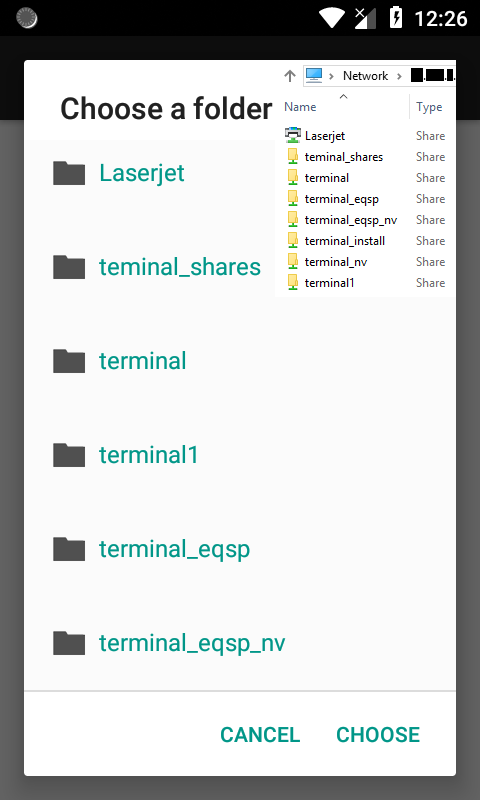
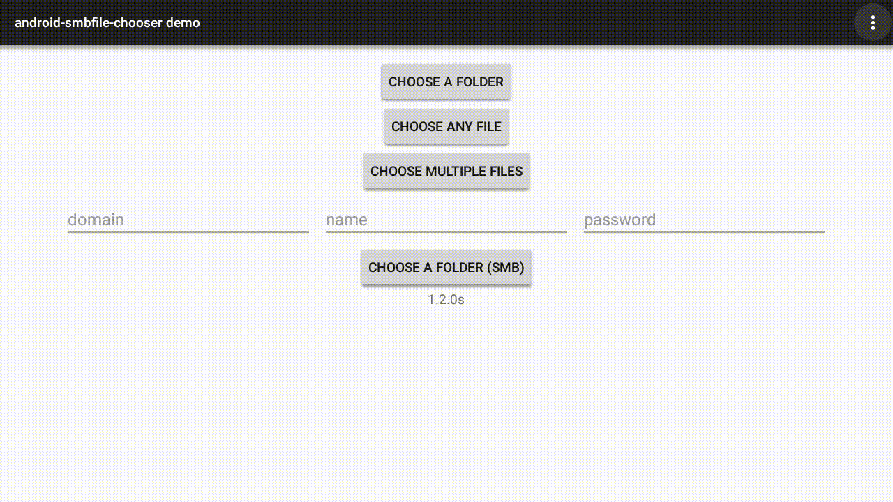

# android-file-chooser


## Overview


### android-file-chooser
[](https://android-arsenal.com/details/1/6982)
[](https://bintray.com/hedzr/maven/filechooser/_latestVersion)
[](https://jitpack.io/#hedzr/android-file-chooser)
### android-smbfile-chooser
[](https://jitpack.io/#Guiorgy/android-smbfile-chooser/)

`android-file-library` is a lightweight file/folder chooser.
This (`android-smbfile-chooser`) is my attempt to add the ability to use [jcifs.smb.SmbFile](https://jcifs.samba.org/) to browse a Windows shared directory.

### Snapshots




### Demo Application

A demo-app of the original can be installed from [Play Store](https://play.google.com/store/apps/details?id=com.obsez.android.lib.filechooser.demo).

<a href='https://play.google.com/store/apps/details?id=com.obsez.android.lib.filechooser.demo&pcampaignid=MKT-Other-global-all-co-prtnr-py-PartBadge-Mar2515-1'></a>

**NOTE**:

I replaced all methods "with___()" with "set___()"! And, use static method "newDialog(context)" instead of a constuctor.
Also, please don't forget to check the [**_upstream_**](https://github.com/hedzr/android-file-chooser) and give it a :star:! 

## Usage

```java
try{
    SmbFileChooserDialog dialog = SmbFileChooserDialog.newDialog(context, "**.***.*.**")
        .setResources("select a directory", "choose", "cancel")
        .setFilter(/*only directories (no files)*/ true, /*don't show hidden files/folders*/ false)
        .setOnChosenListener((path, file) -> {
            try{
                Toast.makeText(context,
                    file.isDirectory() ? "directory" : "file" + " selected: " + path,
                    Toast.LENGTH_SHORT)
                .show();
            } catch(SmbException e){
                e.printStackTrace();
            }
        })
        .build()
        .show();
} catch(MalformedURLException | InterruptedException | ExecutionException e){
    e.printStackTrace();
}
```

#### Additional options
```java
.enableOptions(/*enables 'New folder' and 'Delete'*/ true)
.setOptionResources("New folder", "Delete", "Cancel", "OK")
.setNewFolderFilter(new NewFolderFilter(/*max length of 10*/ 10, /*regex pattern that only allows a to z (lowercase)*/ "^[a-z]*$"))
.enableMultiple(/*enables the ability to select multiple*/ true, /*allows selecting folders along with files*/ true)
.setOnSelectedListener((files) -> {
	ArrayList<String> paths = new ArrayList<String>();
	for (SmbFile file : files) paths.add(file.getPath());
	AlertDialog.Builder dialog = new AlertDialog.Builder(ctx);
	dialog.setTitle("Selected files:");
	dialog.setAdapter(new ArrayAdapter<String>(context, android.R.layout.simple_expandable_list_item_1, paths) , null);
	dialog.show();
})
.enableDpad(/*enables Dpad controls (mainly fot Android TVs)*/ true)
```

## What's Different?
- now you can also pass Strings instead of Resource id. **if Resource id was set, it will take priority over Strings!**
```java
.setOptionResources(0, 0, 0, 0)
.setOptionResources("new folder", "delete", "cancel", "ok")
.setOptionsIcons(R.drawable.ic_menu_24dp, R.drawable.ic_add_24dp, R.drawable.ic_delete_24dp)
```

for more information please refere to the [upstream](https://github.com/hedzr/android-file-chooser).

## Acknowledges

- upstream repo by: [**hedzr**](https://github.com/hedzr)

- logo and banner by: [**iqbalhood**](https://github.com/iqbalhood)
- codes and reports: [**bostrot**](https://github.com/bostrot), [**SeppPenner**](https://github.com/SeppPenner), [**lucian-cm**](https://github.com/lucian-cm), [**ghost**](https://github.com/ghost), [**UmeshBaldaniya46**](https://github.com/UmeshBaldaniya46) ...


## License

Copyright 2015-2018 Hedzr Yeh

Licensed under the Apache License, Version 2.0 (the "License");
you may not use this file except in compliance with the License.
You may obtain a copy of the License at

   http://www.apache.org/licenses/LICENSE-2.0

Unless required by applicable law or agreed to in writing, software
distributed under the License is distributed on an "AS IS" BASIS,
WITHOUT WARRANTIES OR CONDITIONS OF ANY KIND, either express or implied.
See the License for the specific language governing permissions and
limitations under the License.

